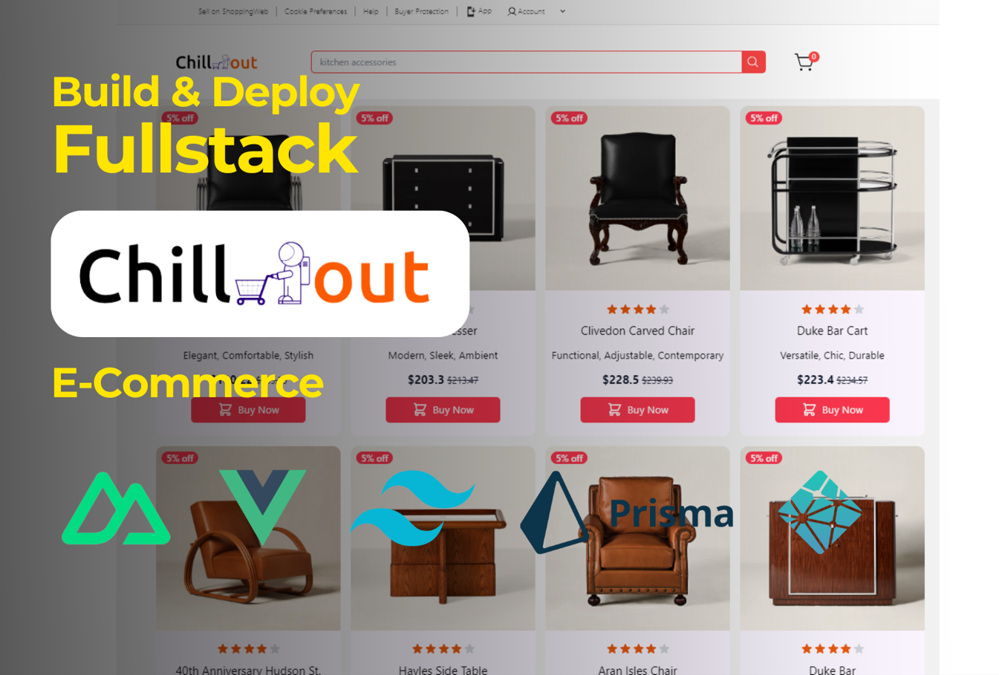

# Chill out: The Super Luxury Funiture Online Shop

## Overview

Welcome to Chill out, your destination for premium, high-end furniture. We offer a curated selection of luxurious pieces designed to enhance the elegance and comfort of your home. Enjoy a seamless shopping experience with our exquisite collection.



## Technologies

- **Nuxt.js**: A framework for building server-side rendered Vue.js applications.
- **Vue.js**: The progressive JavaScript framework for building user interfaces.
- **Pinia**: A state management library for Vue.
- **Tailwind CSS**: A utility-first CSS framework for rapid UI development.
- **PrimeVue**: A rich set of UI components for Vue.
- **Material Design Icons**: A collection of free-to-use, community-driven icons.
- **SweetAlert2**: A beautiful, responsive, customizable, and accessible replacement for JavaScript's popup boxes.
- **Supabase**: An open-source Firebase alternative.
- **Prisma**: A next-generation ORM for Node.js and TypeScript.
- **Lodash**: A modern JavaScript utility library delivering modularity, performance, and extras.

## Our mockup:

https://chilloutwebsite.netlify.app

## Detail of the project

- [Wireframe](./WireFrame/Readme.md)
- [Planning](./Planning/README.md)
- [ERD Diagram](./Database_Description/DATABASE_DESCRIPTION.md)
- [ScreenShot](./Screenshot/README.md)
- [Video](./Video/ReviewVideo.mp4)

## Prerequisites

Before running this project, ensure you have the following installed:

- [Node.js](https://nodejs.org/en/download/)
- [Vue.js](https://vi.vuejs.org/v2/guide/installation)
- [Git](https://git-scm.com/downloads)

## Project Structure

Here is an overview of the main directories and files in the project:

### Directories

- **components**: Contains reusable Vue components.
- **layouts**: Stores layout components that structure the common parts of the application.
- **node_modules**: Directory containing all the project's dependencies.
- **pages**: Contains Vue components representing different pages of the application.
- **prisma**: Contains Prisma configuration and schema files for database management.
- **public**: Static assets that can be directly served by the server.
- **server**: Backend server-related files and configurations.
- **stores**: Contains state management files, likely using Pinia or Vuex.

### Files

- **.env**: Environment variables configuration file.
- **.gitignore**: Specifies which files and directories to ignore in version control.
- **app.vue**: The root Vue component of the application.
- **nuxt.config.ts**: Configuration file for Nuxt.js.
- **package-lock.json**: Automatically generated file that records the exact versions of installed dependencies.
- **package.json**: Lists project dependencies, scripts, and metadata.
- **README.md**: Project documentation file.
- **tsconfig.json**: TypeScript configuration file.

## Setup Instructions

### Clone the Repository

Execute the following commands to clone the repository and navigate to the project directory:

```
git clone https://github.com/hongngoc2449/WebFinalProject-ShoppingWeb.git
cd final-project-chillout-team
```

### Install Dependencies

Install all required dependencies using npm:

```
npm install
```

### Generate Prisma Client

Generate the Prisma client to match your schema with the database:

```
npx prisma generate
```

### Option 1: Use Existing Data on Supabase

Since the data is already stored on Supabase cloud, you can directly start the development server:

```
npm run dev
```

### Option 2: Reset and Seed Database

If you need to reset the database and seed it with initial data on Supabase, execute the following command:

```
npx prisma migrate reset
```

This command resets the database to a clean state and automatically runs the seeding script defined in `prisma/seed.js`. After resetting, start the development server:

```
npm run dev
```

Note: Resetting the database is generally not required unless specifically needed for development purposes.

## Contributors

1. LeTiepTuyen - Tuyen Tiep Le - [Email](mailto:tuyentieple@gmail.com)
2. hongngoc2449 - Ngoc Hong Doan - [Email](mailto:hongngoc2449@gmail.com)
3. LeTuyen2002 - Tuyen Trung Le - [Email](mailto:letrungtuyen2002@gmail.com)
4. WilliamSimon13 - Tin Thieu Mai - [Email](mailto:maithieutin@gmail.com)
